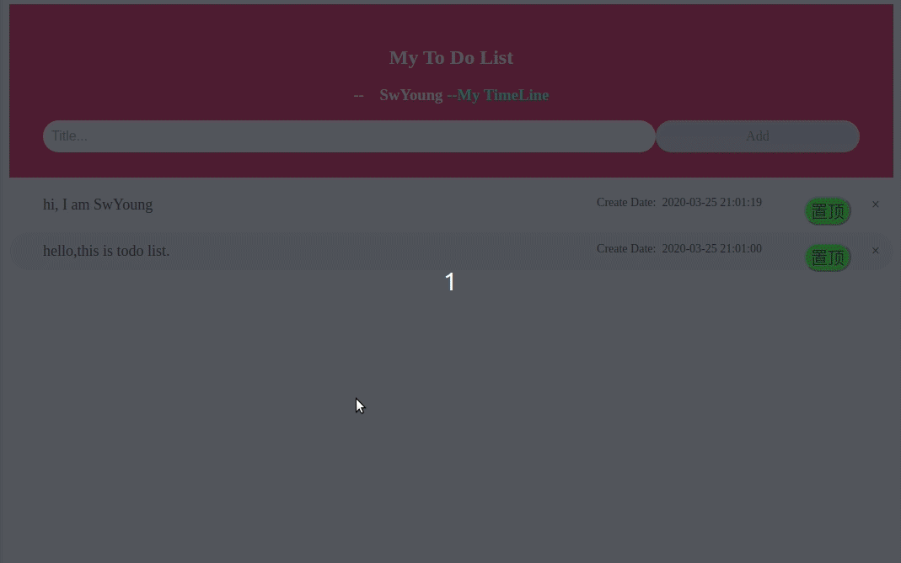

# my todo-list

---

## based on python,flask and mysql

- python2.7
- flask1.1.1
- SQLAlchemy3.0

---

## Demo:


---

### you can use it on your computer

- git clone to local:
```git clone https://github.com/youngsw/ToDoList.git```
- use pycharn to open it.
- chang database to yourself
  - the config about database is ```/ToDoList/app.conf```
- when you create database of todolist, you need to init it.
  - ```python2 manage.py init_database```
---

### It also recommended run on a server

- git clone to your server:
```git clone https://github.com/youngsw/ToDoList.git```
- cd to project file
```cd ToDoList/```

- chang database to yourself
  - the config about database is ```/ToDoList/app.conf```
- when you create database of todolist, you need to init it.
  - ```python2 manage.py init_database```

- use gunicorn to run the project
  ```gunicorn -w 1 -b 127.0.0.1:8002 ToDoList:app #set port 8002```

- set nginx 
  - Reverse request to local port 127.0.0.1:8002
  - ```bash
    # /etc/nginx/site-available/default
    server {
        listen 80;
        server_name yourdomainname; # attention:change to your domain name
        location / {
            proxy_pass http://127.0.0.1:8002;
        }
    }
    ```